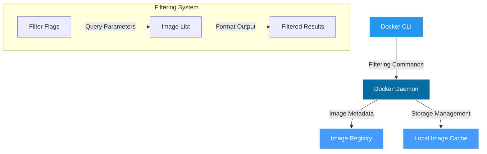

# 🐳 Docker Image Filtering Mastery

[](https://github.com/TheToriqul/docker-image-filtering)
[](https://github.com/TheToriqul/docker-image-filtering/stargazers)


## 📋 Overview

This repository documents my journey in mastering Docker image management through practical exploration of the Docker CLI's filtering capabilities. I've created a comprehensive reference implementation for efficient Docker image filtering and management, focusing on real-world scenarios and best practices. This project demonstrates my ability to efficiently manage Docker images in production environments while showcasing advanced Docker CLI usage patterns.

## 🏗 Technical Architecture

The project focuses on Docker's native image management system, utilizing Docker's built-in filtering and query capabilities. Here's how the components interact:



## 💻 Technical Stack

- **Docker Engine**: Latest version with advanced filtering support
- **Bash Shell**: For script automation and command execution
- **Docker CLI**: Advanced filtering and formatting capabilities
- **Unix Tools**: grep, awk for enhanced filtering capabilities

## ⭐ Key Features

1. Advanced Image Filtering
   - Reference-based filtering
   - Label-based filtering
   - Size-based filtering
   - Creation time filtering

2. Output Formatting
   - Custom format templates
   - Structured data output
   - Machine-readable formats

3. Image Management
   - Dangling image detection
   - Repository-specific filtering
   - Tag-based organization

4. System Optimization
   - Efficient cleanup procedures
   - Storage management
   - Cache optimization

5. Automation Support
   - Scriptable commands
   - CI/CD integration patterns
   - Batch processing capabilities

## 📚 Learning Journey

### Technical Mastery:

1. Docker image architecture and storage patterns
2. Advanced Docker CLI usage and filtering syntax
3. Image metadata management and organization
4. Performance optimization techniques
5. Shell scripting for Docker automation

### Professional Development:

1. Documentation creation and maintenance
2. System administration best practices
3. DevOps workflow optimization
4. Problem-solving in containerized environments
5. Production environment management

## 🔄 Future Enhancements

<details>
<summary>View Planned Improvements</summary>

1. Integration with Docker Compose for multi-container scenarios
2. Custom shell completion scripts
3. Advanced monitoring and alerting
4. Automated cleanup workflows
5. Registry synchronization tools
6. Custom filtering plugins
</details>

## ⚙️ Installation

<details>
<summary>View Installation Details</summary>

### Prerequisites

- Docker Engine (latest version)
- Bash shell environment
- Basic understanding of Docker concepts

### Setup Steps

1. Clone the repository:
```bash
git clone https://github.com/TheToriqul/docker-image-filtering.git
```

2. Navigate to the project directory:
```bash
cd docker-image-filtering
```

3. Make the reference scripts accessible:
```bash
chmod +r ./scripts/*
```

</details>

## 📖 Usage Guide

<details>
<summary>View Usage Details</summary>

### Basic Usage

The repository contains reference scripts and documentation for various Docker image filtering scenarios. Each script includes detailed comments explaining the purpose and usage of different filtering techniques.

### Advanced Features

- Complex filtering combinations
- Custom output formatting
- Automated cleanup procedures
- Size-based filtering

### Troubleshooting

Common issues and solutions are documented in the scripts with detailed comments.

</details>

## 📫 Contact

- 📧 Email: toriqul.int@gmail.com
- 📱 Phone: +65 8936 7705, +8801765 939006

## 🔗 Project Links

- [GitHub Repository](https://github.com/TheToriqul/docker-image-filtering)
- [Documentation](https://github.com/TheToriqul/docker-image-filtering/wiki)

## 👏 Acknowledgments

- [Poridhi for excellent learning opportunities](https://poridhi.io/)
- Docker community for comprehensive documentation
- Fellow developers who provided valuable feedback

---

Feel free to explore, modify, and build upon this configuration as part of my learning journey. You're also welcome to learn from it, and I wish you the best of luck!